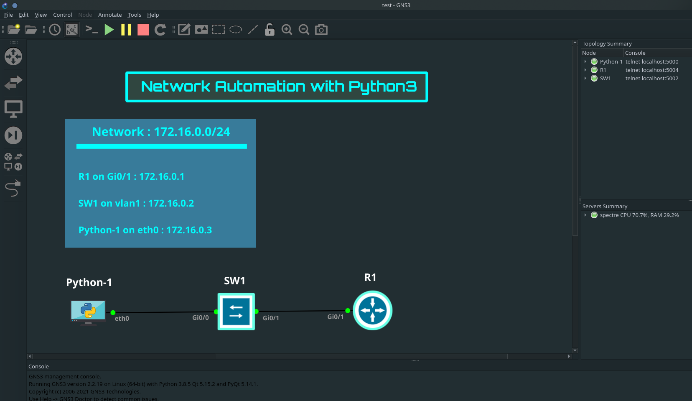
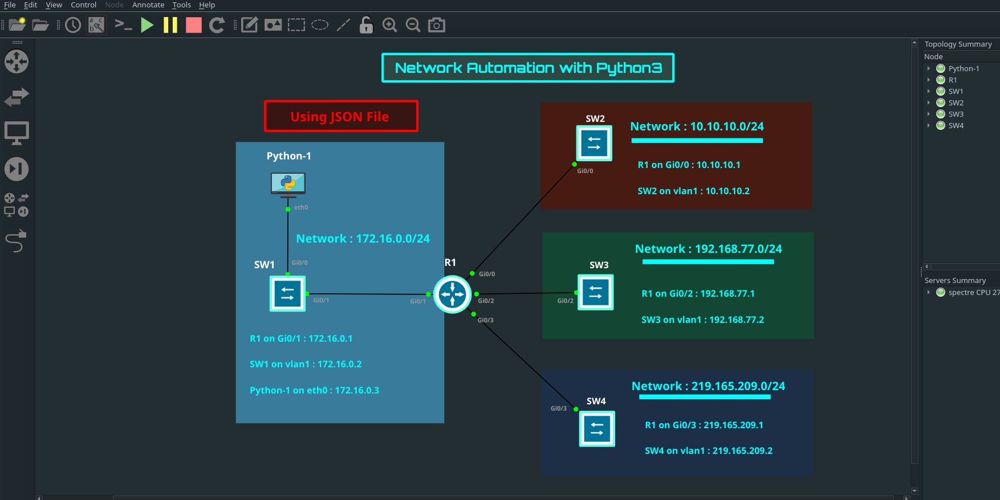

#Network Automation with Python 3 on GNS3 customized GUI (DARK)

Resume of code in Python 3 for Networking Automation created by David Bombal using Telnetlib.

##Part 1

#### First Video 

[Youtube link](https://youtu.be/QhU2bie_t_g)

#### Second Video 

[Youtube link](https://youtu.be/v70JDDm86aU)

##Part 2 

#### First Video 

[Youtube link](https://youtu.be/XD1oy2fSHp8)

#### Second Video 

[Youtube link](https://youtu.be/FSHc0bcmUDc)

